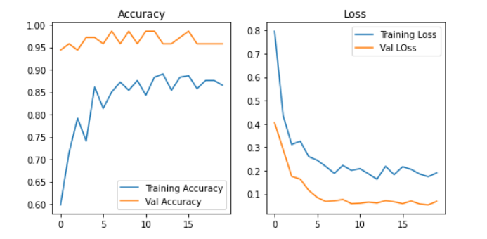

# Covid Infection Detection using X-Ray

Covid symptoms show signs of respiratory infections and lung abnormalities which can be detected by radiologists thus it is possible to use Machine Learning algorithms to detect the disease from images of Chest X-rays.

Covid Detection System is built using Deep Learning to detect covid infection in lungs using x-rays.

## Feature of Covid Infection Detection Model
Model use concept of Transfer Learning with Pre-trained VGG16 model architecture.

## Preview
<p>
<video width="640" height="380" controls autoplay src="Images/Covid Detection.webm" type="video/mp4">
</video>
</p>

# Installations
Follow steps to use this project:

1. Clone repository
```
git clone https://github.com/YashBorikar/Covid-Detection.git
```
2. Change directory to clone repository

```
cd Covid-Detection
```
3. Create a Python virtual environment and activate it
```
$ virtualenv venv
```
```
$ source venv/bin/activate      # For Linux
$ venv\Scripts\activate         # For Windows
```
4. Install required libraries
```
pip install -r requirements.txt
```
# Getting Started

Change directory and Run File
```
cd Flask
python covid-detection.py
```

# Results

<a href="https://colab.research.google.com/drive/15lP2ZwYcSA5iMk_ZMhQBx6-Vndun33Zq?usp=sharing"></a>

 Training Accuracy: 86.50%, Training Loss: 19.05%, Testing Accuracy: 95.77%, Testing Loss: 6.87%
<p>
  
</p>

Model gave 99% accuracy for Face Mask Detection after training
<p>
  
</p>


# Connect me
[](https://www.linkedin.com/in/yashborikar/)